# 🗺️ Nova Arquitetura Estrutural – Gestão de Imóveis (SILIC 2.0)

Esta arquitetura adota o **Contrato** como eixo estruturante do domínio, reduz sobreposição entre entidade/função/processo e mantém rastreabilidade de origem entre **SAP** e **SICLG**.

## Diagrama (Mermaid)

```mermaid
flowchart TB

    A[Gestão de Imóveis]

    A --> B[Portfólio de Imóveis]
    B --> B1[Lista Geral]
    B --> B2[Filtros Avançados]
    B --> B3[Exportação]
    B --> B4[Indicadores Rápidos]

    A --> C[Contrato - Visão 360°]

    C --> C1[1. Dados Gerais]
    C1 --> C11[Número do Contrato]
    C1 --> C12[Unidade / UF]
    C1 --> C13[Status]
    C1 --> C14[Datas Principais]

    C --> C2[2. Imóvel]
    C2 --> C21[Endereço]
    C2 --> C22[Área]
    C2 --> C23[Características Técnicas]
    C2 --> C24[Ocupação]
    C2 --> C25[Documentos Técnicos]

    C --> C3[3. Locador]
    C3 --> C31[Identificação]
    C3 --> C32[Contato]
    C3 --> C33[Dados Bancários]
    C3 --> C34[Histórico de Relacionamento]

    C --> C4[4. Financeiro]
    C4 --> C41[Valor Atual]
    C4 --> C42[Índice de Reajuste]
    C4 --> C43[Histórico de Pagamentos]
    C4 --> C44[Projeção Orçamentária]

    C --> C5[5. Ciclo de Vida]
    C5 --> C51[Assinatura]
    C5 --> C52[Aditivos]
    C5 --> C53[Publicações]
    C5 --> C54[Notificações]
    C5 --> C55[Encerramento]

    C --> C6[6. Compliance e Riscos]
    C6 --> C61[Certidões]
    C6 --> C62[Seguro]
    C6 --> C63[Garantias]
    C6 --> C64[Obrigações Contratuais]
    C6 --> C65[Alertas Automáticos]

    C --> C7[7. Painel de Vencimentos]
    C7 --> C71[ContratoSAP]
    C7 --> C72[VigenciaSAP]
    C7 --> C73[ContratoSICLG]
    C7 --> C74[VigenciaSICLG]
    C7 --> C75[SituacaoSICLG]
    C7 --> C76[UltimoValorPagoSAP]
    C7 --> C77[DecisaoOperacional]
    C7 --> C78[Fase]
    C7 --> C79[Valores de Prorrogação]
    C7 --> C710[Colegiado e AR]
    C7 --> C711[Status da Demanda]

    C --> C8[8. Serviços Vinculados]
    C8 --> C81[Nova Solicitação]
    C8 --> C82[Histórico de Serviços]
    C8 --> C83[SLA]
```

## Decisões de Arquitetura

- **Eixo dominante**: `Contrato` (evita fragmentação por entidade).
- **Portfólio**: visão agregada para consulta, filtro e exportação.
- **Visão 360°**: governança operacional e analítica por contrato.
- **Painel de Vencimentos**: read model consolidado SAP + SICLG + Gestão.
- **Princípio**: divergências entre fontes são exibidas, não ocultadas.

## Objetivo Estratégico

Responder continuamente à pergunta:

> **Quais contratos exigem decisão agora?**

## Benefícios esperados

- Clareza entre entidade, função e processo.
- Escalabilidade para BI, simulações e automação de alertas.
- Rastreabilidade ponta a ponta por origem do dado.
- Evolução incremental sem quebra dos serviços atuais.
